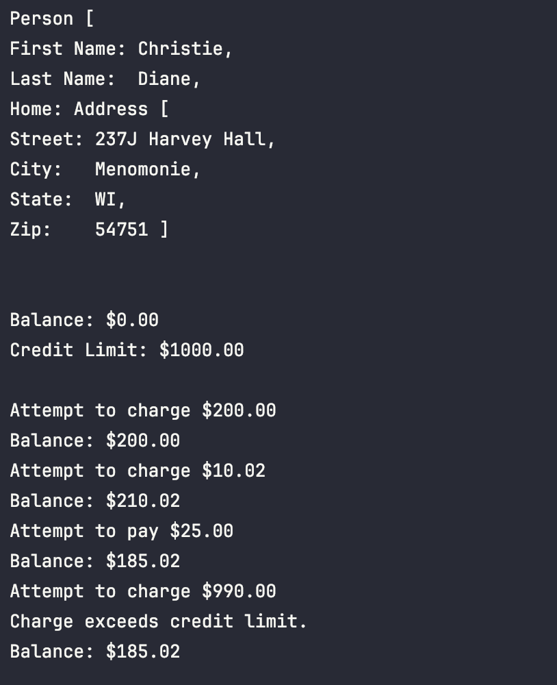

# Advanced Java QAP 2:

**Submitted**:   		**Name**: Jennifer

---

## Reflection Questions:

1. **How many hours did it take you to complete this assessment? Please provide an estimate of the time spent on each part.**
   It took around 5 - 7 hours to complete this assignment.  2-3 hours for Problem 1 and Problem 2.  3-4 hours for the third problem.
2. **What online resources did you utilize to complete this assessment?**
   I mostly referenced this [lab](https://www.asafvarol.com/dnotlar/ymt111ymt112/Lab08.pdf) copyright 2013 by Pearson, when confused by the wording of the QAP.
3. **Did you collaborate with any classmates to solve problems in this assessment? If so, please mention their name.**
   Asked classmates about whether they got similar outputs - the assignment appears to be missing a charge print statement.
4. **Did you require assistance from any instructors to complete this assessment? If so, please specify the number of questions asked or help sessions required.**
   Will be seeing Jordan on Thursday about issues in difference in console output.
5. **Rate the difficulty of each question in this assessment from your perspective, and indicate whether you feel confident in applying similar techniques to solve different problems in the future.**
   I think the difficulty in this assignment was mostly in how it was written.  The instructions could have been much clearer, also when there is code that you want us to copy directly, such as in the case of `CreditCardDemo.java`, the worst option available is in a read-only word file.  Without AI use it is time-comsuming to parse into usable code, and then you have to compare both to make sure it didn't hallucinate the wrong output.  The red zigzags on the UML diagrams also make them harder to read.  Also the wording is confusing, the copy of the lab I found online gives code for the user to copy, so when it says "the constructor that you will write is a copy constructor" it isn't confusing.  There is no given code for us to copy besides `CreditCardDemo`, so I wrote all of the constructors.  I am confident in being able to apply similar techniques, but I would have learned more from the assignment if it were clearer, and had better formatting.

---

## Problem 1 : Line

### Test Code

---

## Exercise 2: Rectangle

### Class Diagram

### Test Code

---

## Exercise 3: Aggregation

### Test Code

---
