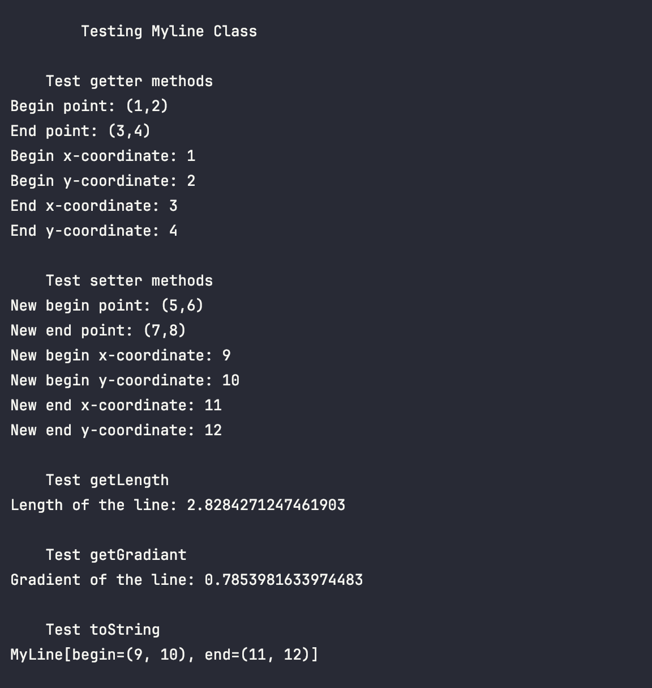
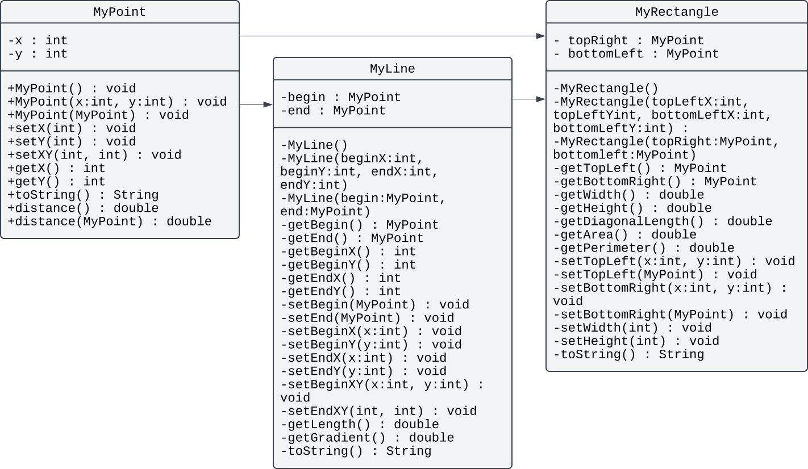
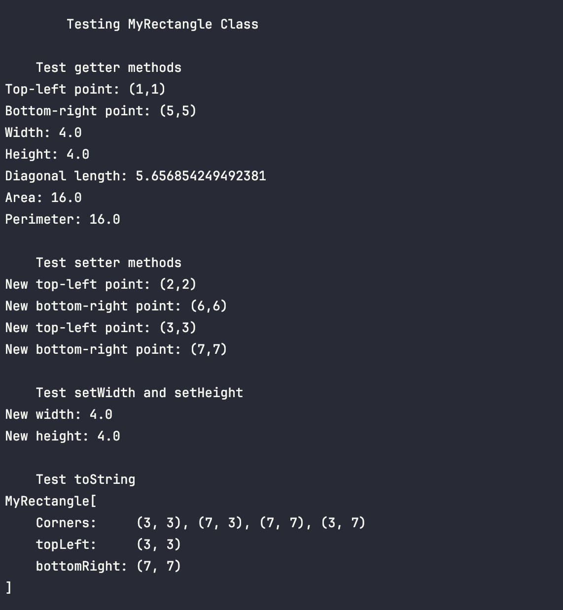

# Advanced Java QAP 2:

**Submitted**:   		**Name**: Jennifer

---

## Reflection Questions:

1. **How many hours did it take you to complete this assessment? Please provide an estimate of the time spent on each part.**
2. **What online resources did you utilize to complete this assessment?**
3. **Did you collaborate with any classmates to solve problems in this assessment? If so, please mention their name.**
4. **Did you require assistance from any instructors to complete this assessment? If so, please specify the number of questions asked or help sessions required.**
5. **Rate the difficulty of each question in this assessment from your perspective, and indicate whether you feel confident in applying similar techniques to solve different problems in the future.**

---

## Problem 1 : Line

### Test Code

---

## Exercise 2: Rectangle

### Class Diagram

### Test Code

---

## Exercise 3: Aggregation

---
